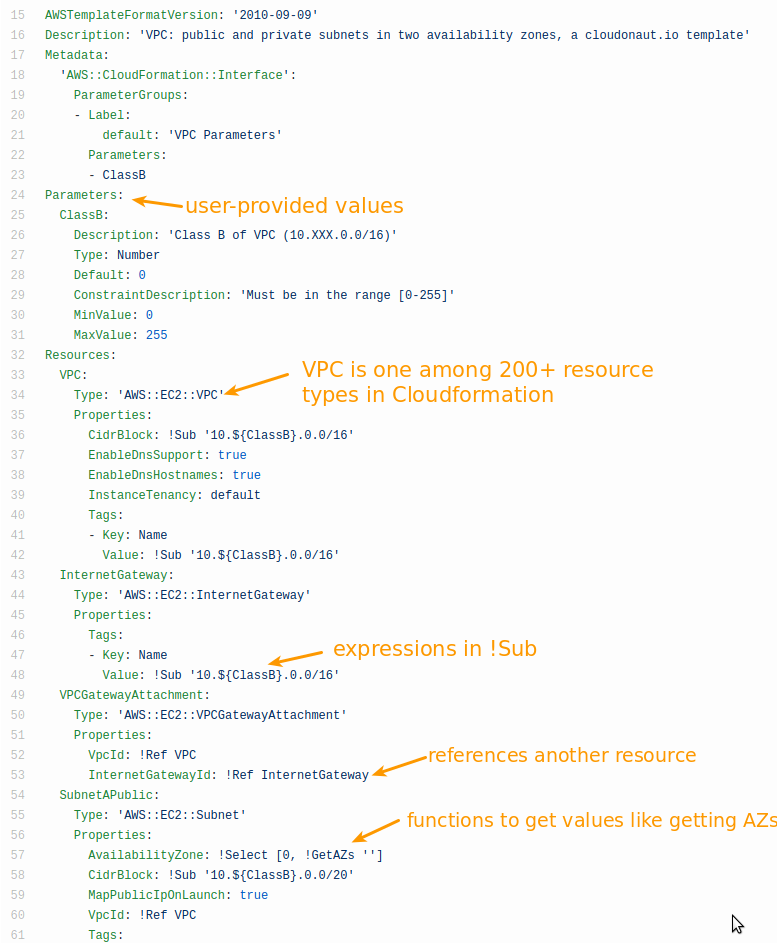

# Obligatory Introduction
## What’s CloudFormation
Cloudformation is a free service from AWS that allows you to describe your cloud infrastructure and provision your infrastructure in an automated way. You write these templates in YAML/JSON, deploy it via the management console, CLI or the SDKs and AWS will produce the equivalent infrastructure in your AWS account. In Cloudformation parlance, the created resources form a “stack” based on your template.

Cloudformation is the primary tool provided by AWS for the “Infrastructure as Code” practice. This means that their files are treated like normal application source code, e.g they are put in version control, deployed automatically, etc.

Cloudformation is a widely adopted tool and if you adopt this in your team, then you will be part of a community that are sharing solutions, their experiences, code, etc. Read on to learn more on how to make the most out of it. 

## What it looks like
This is what a Cloudformation template looks like, in YAML syntax:

