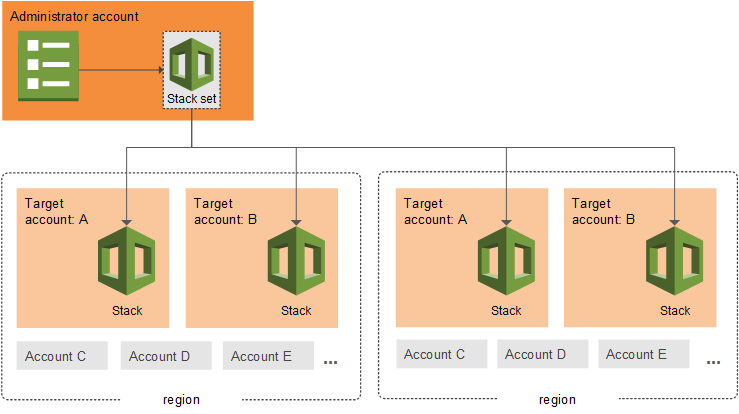
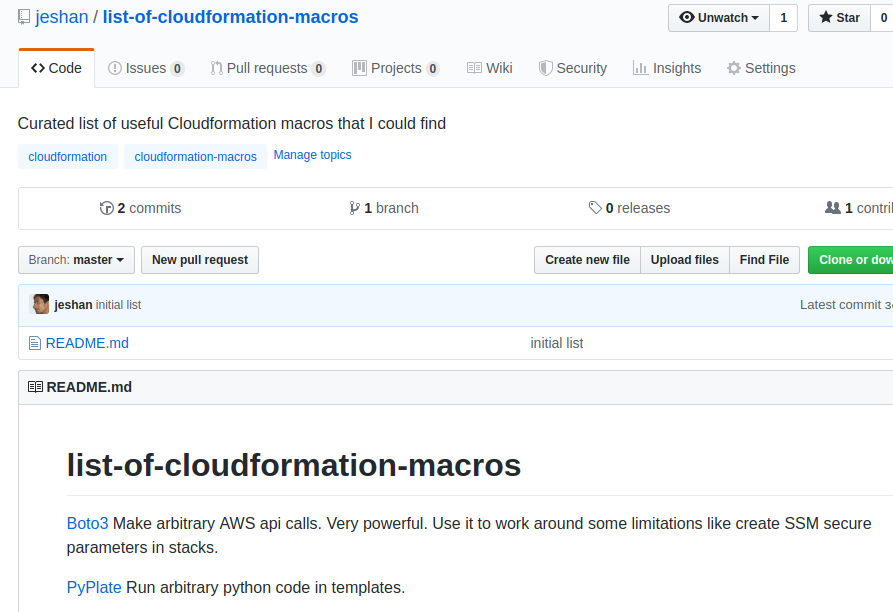
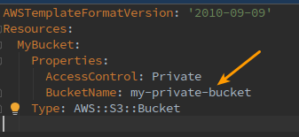

# Key features of Cloudformation
Here, we list some of the most important features available. They are mentioned briefly now but will be expanded on in further sections.

## Declarative style
You write resources in any order and Cloudformation will figure out the right order to create them. Where possible, Cloudformation will also parallelise the process to make the process go faster.

## Programming experience optional
Cloudformation syntax is so simple that it does not require programming experience. They can be written in text editors by anybody reasonably savvy with AWS.

## Reusable templates
A Cloudformation stack comes out of a template. In fact, the template is reusable within the same AWS account or region. This means that templates can be used to create the same resources in development, testing, production, etc. When the template is updated, these stacks can benefit from the same updates and the stacks can be kept identical to ensure parity.

## Security
You can restrict changes to the stacks with IAM roles which are the same concept widely used elsewhere on AWS. You can also use the security feature to prevent accidental changes to the stack. Learn about such service roles [here](https://docs.aws.amazon.com/AWSCloudFormation/latest/UserGuide/using-iam-servicerole.html?shortFooter=true).

## Stacksets
Stacksets are a concept that allow you to deploy the same templates in multiple regions and accounts at the same time. An especially interesting feature is, like with single stacks, it can rollback the whole process with multiple stacks in a stackset. To learn more, check out [their docs](https://docs.aws.amazon.com/AWSCloudFormation/latest/UserGuide/what-is-cfnstacksets.html).

Source: AWS docs. Copyright AWS.

## Commitable to code repository
The templates, being in plain text, can be treated just like source code. They can be committed to version control (e.g Git). In fact, this practice is called “Infrastructure as Code” and it is highly encouraged that you follow this. This means that templates are:

### Shareable
Anybody in the team can inspect the templates, modify them or even offer feedback on how to make them better.

Templates can be shared privately or publicly as you wish. People contribute many such templates on Github and there are many useful ones, e.g the [Cloudonaut VPC template](https://templates.cloudonaut.io/en/stable/vpc/) can help you save time in a complicated setup like a VPC.

### Versioned
When you commit the templates, you can know who made what changes and when. This is useful when you need to audit or just keep track of what is changing in your AWS accounts. This also implies that if you need to revert to older versions, you can revert the commits and can deploy the old versions again.

### Deployable via CI/CD
Ideally you want Cloudformation updates to happen automatically. Since dev teams usually deploy applications via Continuous Integration (CI) / Continuous Delivery (CD) tools, then they can do the same for infrastructure. The CI/CD tool can be made to deploy the cloudformation templates in multiple accounts, ensuring the process is reliable and fast. See [this link](https://docs.aws.amazon.com/AWSCloudFormation/latest/UserGuide/continuous-delivery-codepipeline.html) for a detailed explanation with AWS CodePipeline.

## Diagrams
Plain files mean that tools that can read your templates and generate beautiful images on what resources you have and how they link together. This makes it easier for people to understand your templates and makes for a great addition to your documentation. An example of such a tool is the AWS [Cloudformation designer](https://docs.aws.amazon.com/AWSCloudFormation/latest/UserGuide/working-with-templates-cfn-designer.html). You can give it your template and it outputs a downloadable image file. More on this tool in a further section.

## Static analysis
Plain files also imply that they are parseable by software. As such, resource definitions in your templates can be statically analysed for issues. For example, the [cfn-nag](https://github.com/stelligent/cfn_nag) tool statically analyses your resources for security or other issues and lets you know in case you misconfigured them. cfn-nag will be described later.

## Macros
Macros are a recent feature that allows arbitrary transformations of templates. This gives the opportunity to run some code to change the templates at runtime. This code can be simple functions like string manipulation, creating S3 objects or make remote API calls.

The AWS docs explain well on how to use it:
https://docs.aws.amazon.com/AWSCloudFormation/latest/UserGuide/template-macros.html

Here is a curated list of macros that you may find useful:

https://github.com/jeshan/list-of-cloudformation-macros

## Changesets
It may not be obvious what will happen to your resources before you invoke Cloudformation. E.g If you update the bucket name property in Cloudformation, you may think that it will seamlessly rename the bucket.

But it is not possible to rename an S3 bucket. What it will do instead is it will:

- Create a bucket under the new name
- Then delete the bucket that has the old name

This may not be what you intended. You can use a changeset to preview the change that is about to happen. When you’re satisfied with it, you can execute the changeset. Otherwise, edit your template and repeat. See the chapter [Mistakes to avoid while working with Cloudformation](mistakes-to-avoid.md).

