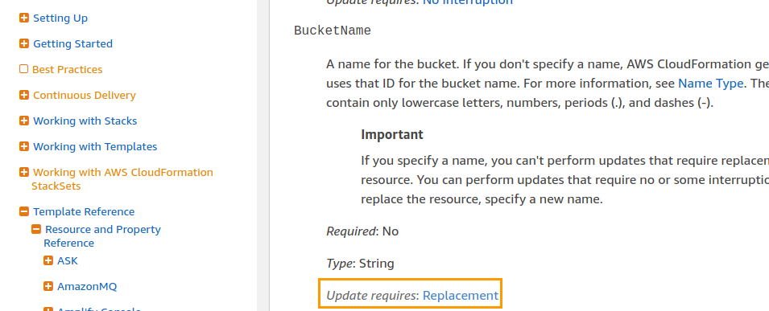
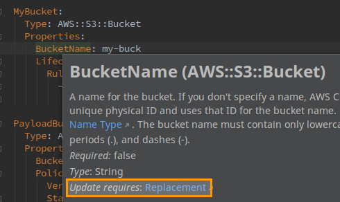

# Mistakes to avoid while working with Cloudformation
## Not paying attention to resource lifecycle policies
When you’re adding or deleting resource snippets from templates, it’s easy to guess what Cloudformation will do (i.e effect the corresponding change in AWS). But sometimes, it’s not obvious what will happen if a resource definition is updated; it could update the resource or create its replacement in AWS.

Here are 3 solutions from least to most practical:
### Have the relevant docs page open
For example, the docs page for the S3 bucket:


You can spot if you change a certain property, the docs will say “Update requires: …”. If it says “Replacement”, you should pay special attention here.

### Use an IDE plugin
The [AWS Cloudformation plugin for JetBrains](https://plugins.jetbrains.com/plugin/7371-aws-cloudformation) shows the same docs just mentioned but in a more handy fashion. This include a line that specifies whether the resource will be replaced:


It’s the same as above, but slightly more practical.

### Use changesets
This is the most reliable option; Cloudformation can show you a preview on what changes will happen if you go ahead with a stack update. You could use the AWS CLI but the sceptre launcher makes it easy to view these changesets.
Example: Suppose I want to add a NAT gateway to the vpc stack in my test environment. It also requires a route in a route table but also an Elastic IP. I run the following commands with sceptre:

```bash
sceptre create -y test/vpc add-nat-gateway
sceptre --output json describe change-set test/vpc add-nat-gateway
```

The following output appears:
```json
{
  "ChangeSetName": "add-nat-gateway",
  "StackName": "project-test-vpc",
  "CreationTime": "2019-07-02 08:14:47.189000+00:00",
  "ExecutionStatus": "AVAILABLE",
  "Status": "CREATE_COMPLETE",
  "Changes": [
    {
      "ResourceChange": {
      "Action": "Add",
      "LogicalResourceId": "EIP",
      "ResourceType": "AWS::EC2::EIP",
      "Scope": []
      }
    },
    {
      "ResourceChange": {
      "Action": "Add",
      "LogicalResourceId": "NatGateway",
      "ResourceType": "AWS::EC2::NatGateway",
      "Scope": []
      }
    },
    {
      "ResourceChange": {
      "Action": "Add",
      "LogicalResourceId": "Route",
      "ResourceType": "AWS::EC2::Route",
      "Scope": []
      }
    }
  ]
}
```

Another example is if I changed a VPC Flow log’s _LogDestination_ property. Sceptre would show me the “Replacement”: “True”. This tells you that the flow log will be replaced:
```json
{
  "ResourceChange": {
    "Action": "Modify",
    "LogicalResourceId": "SubnetFlowLog",
    "PhysicalResourceId": "fl-0e1a4022c6e991234",
    "ResourceType": "AWS::EC2::FlowLog",
    "Replacement": "True",
    "Scope": [
      "Properties"
    ]
  }
}
```
Or if I renamed an S3 bucket:
```json
{
  "ResourceChange": {
    "Action": "Modify",
    "LogicalResourceId": "MyBucket",
    "PhysicalResourceId": "my-project-mybucket-1h66dhhrlazyq",
    "ResourceType": "AWS::S3::Bucket",
    "Replacement": "True",
    "Scope": [
      "Properties"
    ]
  }
}
```
## Not checking the best practices
This too is a huge time saver. You will not only improve your productivity but also learn about security when dealing with CloudFormation. (See [Link to the chapter](successful.md#review-best-practices)).
