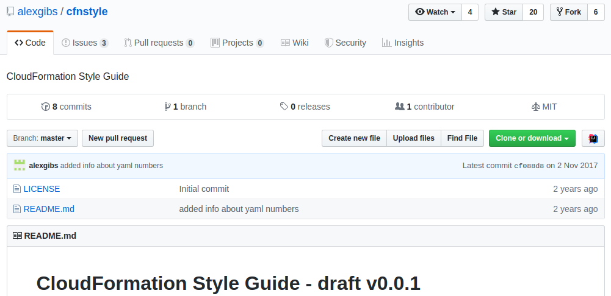
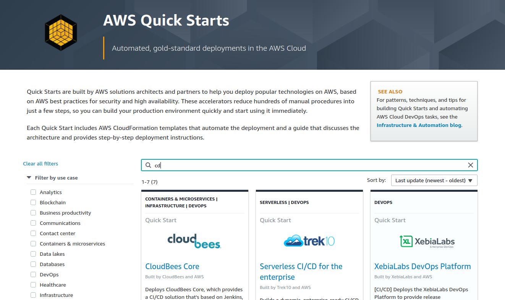
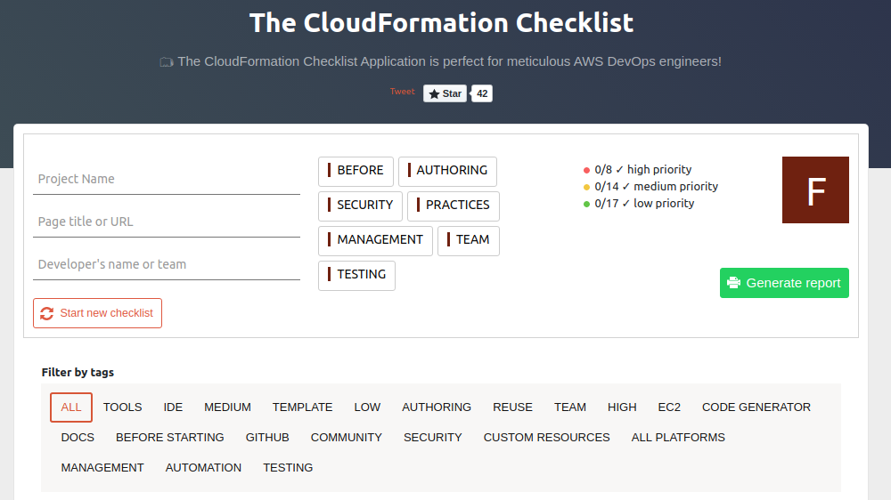
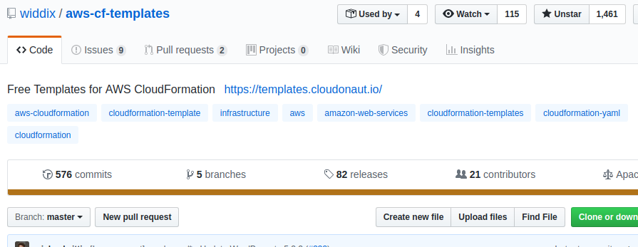
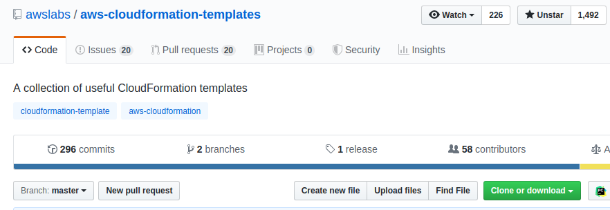
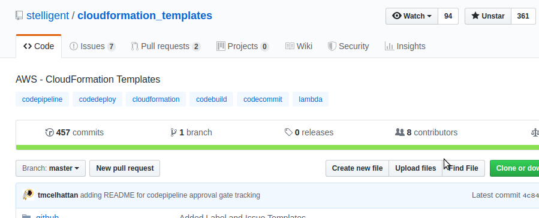
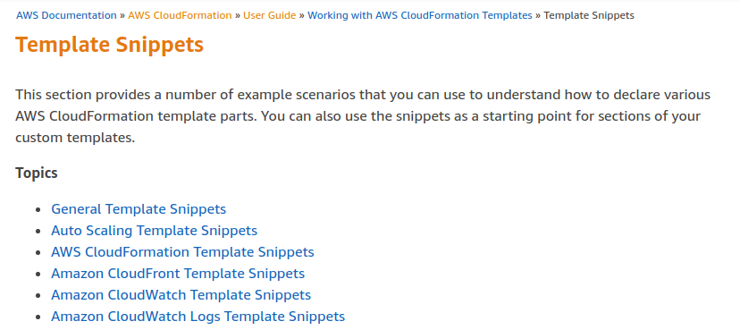
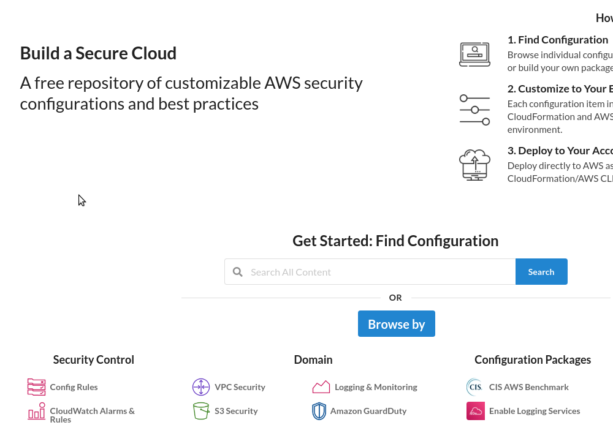
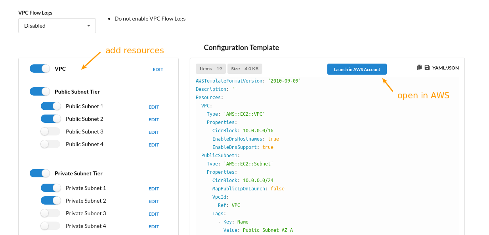

# Setting yourself up to be successful with Cloudformation
## Keep it simple
You may be tempted to use code to generate templates like [Troposphere](https://github.com/cloudtools/troposphere). I advise against that. Use pure YAML/JSON before looking for a code generator. This will encourage you to:
- simplify your templates.
- enable non-developers to collaborate on templates.

Instead of usual primitives like conditionals in programming language, you can often get away with the [intrinsic functions](https://docs.aws.amazon.com/AWSCloudFormation/latest/UserGuide/intrinsic-function-reference.html) and [pseudo parameters](https://docs.aws.amazon.com/AWSCloudFormation/latest/UserGuide/pseudo-parameter-reference.html) features already available in Cloudformation. If it’s not enough, you can [use Macros](key-features.md#macros) to transform the templates before executing them.

## Review Best practices
AWS has published more than a dozen best practices here:
https://docs.aws.amazon.com/AWSCloudFormation/latest/UserGuide/best-practices.html

Some selected ones from the link above:
### Use Code Reviews and Revision Controls to Manage Your Templates
As covered before, your templates should be committed to your code repository. This allows team members to give feedback on the templates and track when changes are made to them.

### Manage All Stack Resources Through AWS CloudFormation
Resources may not be static so you may need to change them later. Don’t update the resources outside the stack. This is because Cloudformation keeps an internal state in which it tracks the resource’s current state. If you update the resource outside the stack, Cloudformation will not be aware of it and this may cause errors when you invoke it again later. Make all changes through Cloudformation itself as much as possible.

### Use Stack Policies
Some resources need to be protected against accidents, e.g an RDS database must not be replaced or deleted if it has important data.
To mitigate this, you can set a stack policy on a stack. In it, you can describe what actions may be allowed or denied, similar to IAM policies.

### Final note
Finally, please note that the community has come up with their own style guides. For example, the following repository has many tactical tips on how to write templates properly:

https://github.com/alexgibs/cfnstyle

## Don’t feel the need to write templates from scratch
The plain text nature of templates make it easy to be shared privately but especially publicly on the Internet. Here are some notable open source repositories that you can check out. Just like using libraries, use these templates to not reinvent the wheel but also because they are well-tested.
### AWS Quickstarts

Tried and tested templates from AWS and their partners:

https://aws.amazon.com/quickstart

Example solutions that you can find in there:
- Real-Time Insights on AWS Account Activity: _Deploy a solution that automatically provisions and configures the services necessary to record and visualize resource access and usage metrics for your AWS account(s) in real-time._
- Centralised Logging: _Deploy a centralised logging solution for collecting, analysing, and displaying logs on AWS across multiple accounts and AWS Regions._
- AWS CloudFormation Validation Pipeline: _Automatically test and check for integrity in your templates_
- CI/CD pipeline for AWS CloudFormation templates: _Deploys a pipeline to automatically test AWS CloudFormation templates from a GitHub repository. Includes AWS TaskCat for testing, AWS CodePipeline for continuous integration, and AWS CodeBuild as the build service_

### Other open source solutions
Some notable ones:
#### CloudFormation Checklist

This checklist helps you maximise your productivity and your experience when working with CloudFormation in the following ways:
- Shows the IDE tools to install for developer productivity
- Best practices to follow
- Help automation tips

and much more.

A lot of what’s covered in this document is made handy in the checklist. Just open and start using (no setup needed):
https://cfnchecklist.com

#### widdix/aws-cf-templates

This repository includes templates that cover VPCs, operations, containers, security, wordpress, etc:

https://github.com/widdix/aws-cf-templates

#### aws-cloudformation-templates

This repository includes templates for Database Migration, DynamoDB and other templates that AWS include in their documentation:

https://github.com/awslabs/aws-cloudformation-templates

#### stelligent/cloudformation_templates

https://github.com/stelligent/cloudformation_templates

#### AWS template snippets
Besides full templates, there are many snippets available for specific services here:

https://docs.aws.amazon.com/AWSCloudFormation/latest/UserGuide/CHAP_TemplateQuickRef.html

### asecure.cloud
This website hosts a collection of free templates from various sources, including some from the above mentioned.

You can inspect the template, set some parameters and it also facilitates deploying it right away to your AWS account:

Note: this vendor has not been widely vetted and is still in beta. Please carry some due diligence before using them in any serious work.

Homepage: https://asecure.cloud

## Eliminate the grunt work
Just like you don’t have to reinvent the solutions presented, doesn’t mean you have to put on yourself the burden of writing every line by yourself when you are designing your infrastructure from scratch. Review the [tools mentioned](tools.md#template-generator-tools), experiment by manually creating the resources. Then from it, generate the snippets and bring them under version control.
