# Summary of tools to help you work with CloudFormation
These are some free tools and their limitations to help you with this process / tools to help adopt cfn:

## Sceptre
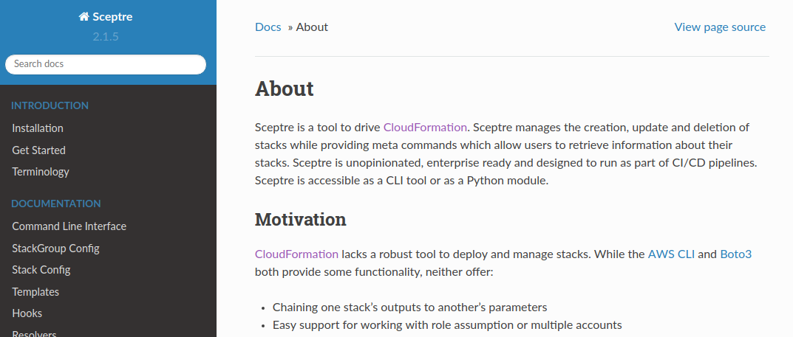
Cloudformation stacks are operated one-by-one (unless you’re using the same template in stacksets). 
Use _sceptre_ to reduce the amount of code needed to coordinate among them.

All of its main features dramatically reduce need of scripts to coordinate deployments.

Benefits:
- Deploy multiple stacks at a time
- Handles multiple environments (i.e accounts and regions)
- Can pass output from a stack to another
- Plugins like [sceptre-aws-resolver](shortcomings.md#use-the-sceptre-aws-resolver-plugin-for-sceptre) make it more powerful

To give you a sample, here is how you would normally deploy a template with the AWS CLI:
```bash
aws cloudformation deploy --stack-name my-stack --region us-east-1 --template-file base.yaml --profile test --capabilities CAPABILITY_IAM --parameter-overrides Param1=Value1 Param2=Value2 ...
```
With sceptre, it’s simplifable to:
```bash
sceptre launch -y test/my-stack
```

Review its docs for more interesting features:

https://sceptre.cloudreach.com/latest/index.html

## Cloudformation designer
Plain text is hard to understand. You can use the [Cloudformation designer](https://docs.aws.amazon.com/AWSCloudFormation/latest/UserGuide/working-with-templates-cfn-designer.html) to create good looking images from your templates. It also offers a drag-and-drop tool to fasten template authoring.

Benefits:
- Makes your infrastructure easier to understand
- Offers code assistance to write cloudformation templates
- Can include these images in your documentation

Drawbacks:
- Images must be manually generated; there is no API to invoke it.
- It’s limited to resources defined in your template. You cannot generate images based on existing resources.

## Troposphere
Some people relying on JSON/YAML is too limiting. One solution is the use of this Troposphere library
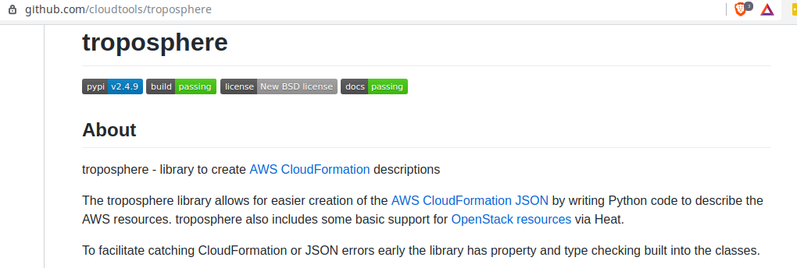

With it, you can write arbitrary Python code and it outputs a cloudformation template. This allows you to leverage the full power of the Python language.
Another advantage is it comes with type checks which allows for some code assistance while authoring with Troposphere.
Sceptre supports Troposphere as well as plain templates; combine them with great productivity. Here is a basic snippet from the docs:

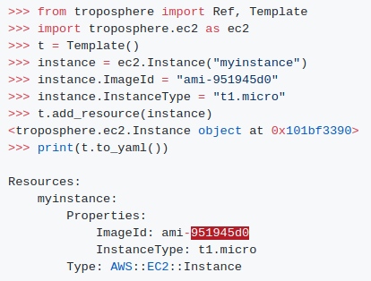

Homepage: https://github.com/cloudtools/troposphere

While Troposphere is for Python, there are similar alternatives for other languages, e.g:
- [goformation](https://github.com/awslabs/goformation) for Go lang
- [cloudformation-ruby-dsl](https://github.com/bazaarvoice/cloudformation-ruby-dsl) for Ruby
- [cloudformation-template-generator](https://github.com/MonsantoCo/cloudformation-template-generator) for Scala

## Static analysis tools
### cfn-python-lint
This is a cli tool that statically analyses cloudformation templates. It checks for valid values and if the templates follow certain best practices. Use the [available IDE plugins](https://github.com/aws-cloudformation/cfn-python-lint#editor-plugins) to continuously keep your templates in check.

https://github.com/aws-cloudformation/cfn-python-lint

### cfn_nag
This is a static analysis tool that scans for templates against potential issues.
It can help you fix some low-hanging fruit issues like overly permissive permissions or if you’ve enabled key rotation on your KMS keys. The usual practice is to run cfn-nag in your CI/CD pipeline, preventing you from deploying insecure infrastructure. 

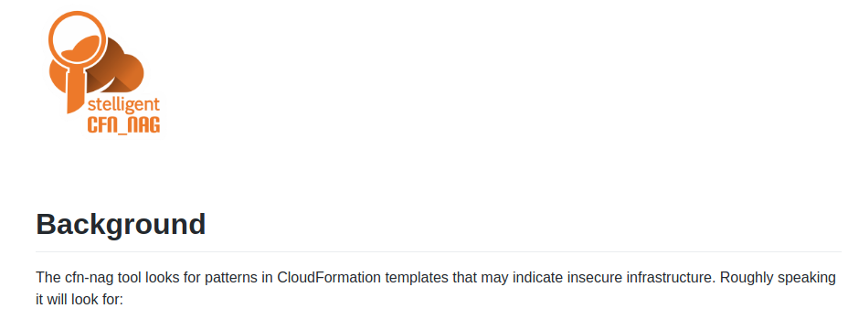
Check their home page out on Github:
https://github.com/stelligent/cfn_nag

The list of about 45 rules is available here:
https://github.com/stelligent/cfn_nag/tree/master/spec/custom_rules


## IDE plugins to work with Cloudformation
Writing templates without IDE help is slow and tedious. Use the following plugins to make your life easier 
### For Jetbrains IDEs
#### AWS CloudFormation

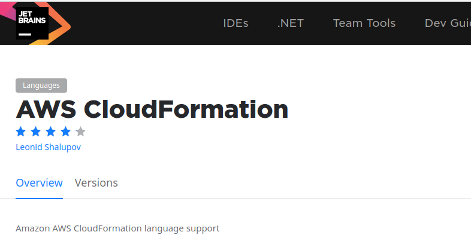
This one is for JetBrains IDEs (Intellij, PyCharm, etc)

https://plugins.jetbrains.com/plugin/7371-aws-cloudformation

It understand a comprehensive list of resource types and provides code completion for resources.

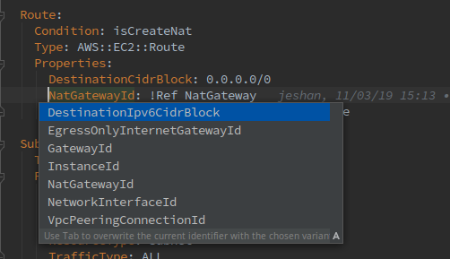
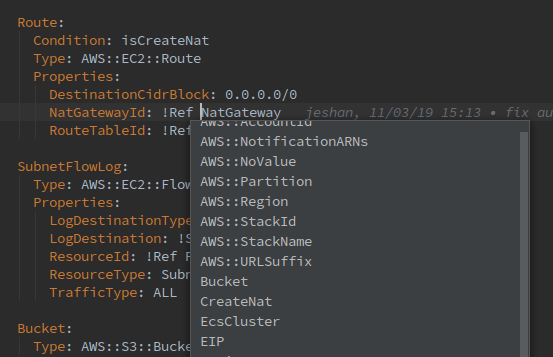


#### Typeformation

https://plugins.jetbrains.com/plugin/10653-typeformation

Makes it easy to fill in values and covers dozens of services.
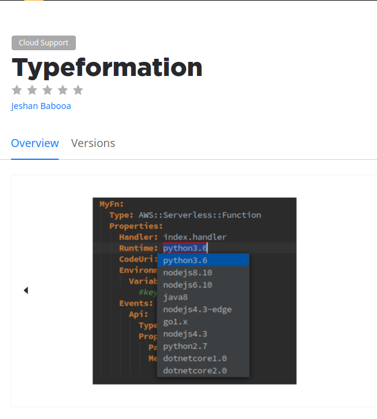
### Visual Studio Code
This is a popular one for Visual Studio Code that has about the same features as the one before.

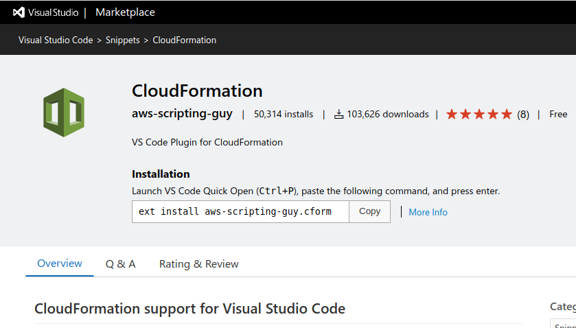


## AWS retriever
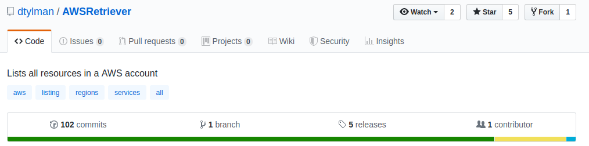
Scans your AWS resources and saves them for offline reading.

Benefits:
Easy to use; scan is done in one step
Supports broad range of APIs

Drawbacks:
The JSON output is not suitable for CloudFormation templates

https://github.com/dtylman/AWSRetriever

## Template generator tools
These free tools generate cloudformation templates or snippets based on your existing resources.

### Cloudformer
This is the a tool created and supported by AWS. As it says in [their docs](https://docs.aws.amazon.com/AWSCloudFormation/latest/UserGuide/cfn-using-cloudformer.html?shortFooter=true):

> “CloudFormer is a template creation beta tool that creates an AWS CloudFormation template from existing AWS resources in your account. You select any supported AWS resources that are running in your account, and CloudFormer creates a template in an Amazon S3 bucket.”

Unfortunately it supports only few resource types, doesn’t find relationships among resources and hasn’t received updates in many years. The next resources in this section are better alternatives.

### AWS Console Recorder
This is a great Chrome/Firefox extension to accompany your AWS management console use. When you enable it, it records resources that you’re creating in there and outputs a Cloudformation equivalent for the resources.
https://github.com/iann0036/AWSConsoleRecorder

Benefits:
- Wide coverage of resources
- Supports many outputs besides Cloudformation, e.g Troposphere, Terraform, etc.

Drawbacks:
- May not cover all properties since [only the initial API call is covered](https://github.com/iann0036/AWSConsoleRecorder/issues/34#issuecomment-474219023). This means that tag properties will likely be omitted.
- Supports only create operations. This means that existing resources won’t be covered.

### Former2
This is the best free tool to generate Cloudformation templates from your existing resources that is currently available.
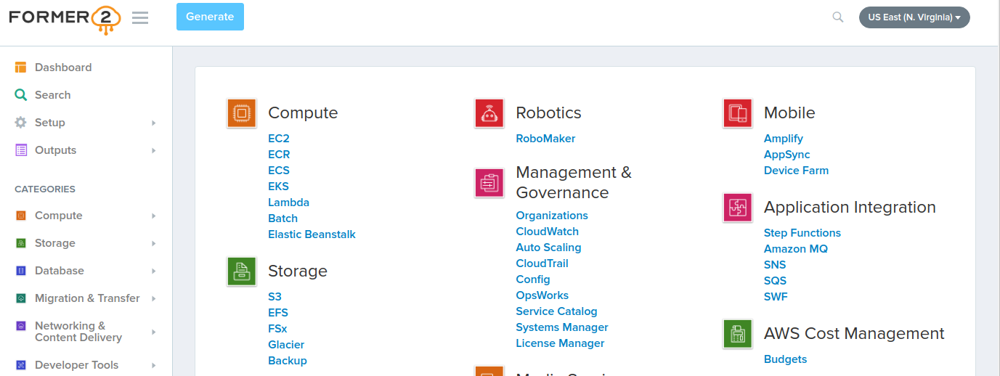

Benefits:
- Comprehensive coverage of resource type
- Search for resources based on keywords, tags or other values

Drawbacks:
- Slow to complete; it scans one region at a time.
- Has performance issues, e.g search with hundreds may cause browser tab to freeze.
- Does not leverage caching; needs to trigger scan on every open
- No out-of-the-box experience. Somebody will still need to generate this manually and regularly and share templates with the rest of the team

Check its github page:

https://github.com/iann0036/former2

Or use it directly in your browser here:

https://former2.com
